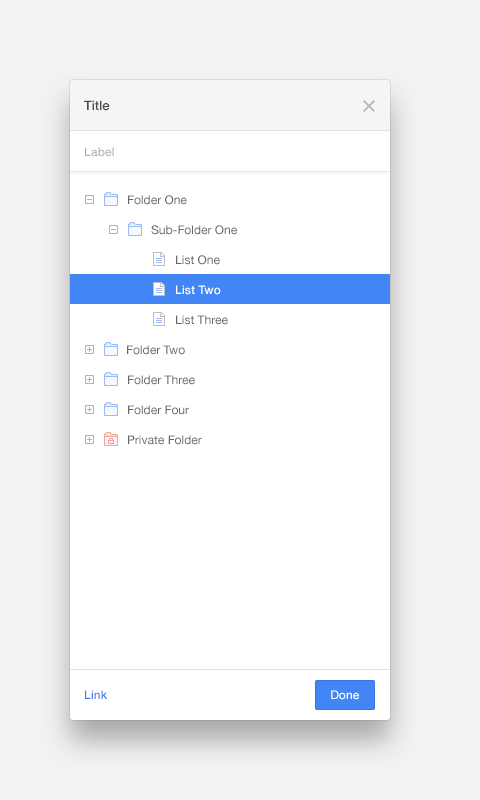

# Exercise: DOM Tree as a File System

> This exercise is to build something that represents the DOM tree of a website as a file and folder explorer.



## Getting Started
Clone the repo and install Node.js modules:

```
$ git clone git@github.com:tehkaiyu/dom-tree-modal.git .
$ yarn
```

## Directory Layout

```
├── /bin/                         # Api and server binary
├── /node_modules/                # 3rd-party libraries and utilities
├── /public/                      # React built files
├── /src/
│   ├── /components               # React dumb components, reusable across all pages
│   ├── /containers               # React smart components/pages
│── package.json                  # Dev dependencies and NPM scripts
└── README.md                     # Project overview
```

## Server Commands

In the project directory, you can run:

### Development
```bash
yarn dev
```

Runs the app in the development mode.<br>
Open [http://localhost:3000](http://localhost:3000) to view it in the browser.

The page will reload if you make edits.<br>
You will also see any lint errors in the console.


### Testing
```bash
yarn test
```

*Tests coming soon*
Launches the test runner in the interactive watch mode.<br>


### Production

```bash
yarn build
```

Builds the app for production to the `build` folder.<br>
It correctly bundles React in production mode and optimizes the build for the best performance.

The build is minified and the filenames include the hashes.
